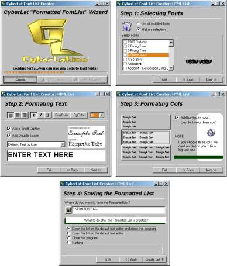



## A Formatted Font List Creator

### Description

This code creates a file list in HTML or RTF format WITHOUT USING OCX OR API CALLS. You can make a font selection, set the font properties like bold, italic, underline, font and background colors,example text, text size, cols number and more. This program will save hours for you from typing in front of your computer, because it will create the list, so you can have a printed preview of your favorites fonts.

A MUST SEE CODE. DOWNLOAD IT NOW... And Vote for it if you like it!!!
 
### More Info
 

             |
---                |---
**Submitted On**   |2000-11-02 18:54:30
**By**             |[Mauricio Castelazo Gamboa](https://github.com/Planet-Source-Code/PSCIndex/blob/master/ByAuthor/mauricio-castelazo-gamboa.md)
**Level**          |Intermediate
**User Rating**    |4.4 (31 globes from 7 users)
**Compatibility**  |VB 4\.0 \(32\-bit\), VB 5\.0, VB 6\.0
**Category**       |[Internet/ HTML](https://github.com/Planet-Source-Code/PSCIndex/blob/master/ByCategory/internet-html__1-34.md)
**World**          |[Visual Basic](https://github.com/Planet-Source-Code/PSCIndex/blob/master/ByWorld/visual-basic.md)
**Archive File**   |[CODE\_UPLOAD113211152000\.zip](https://github.com/Planet-Source-Code/mauricio-castelazo-gamboa-a-formatted-font-list-creator__1-12549/archive/master.zip)

